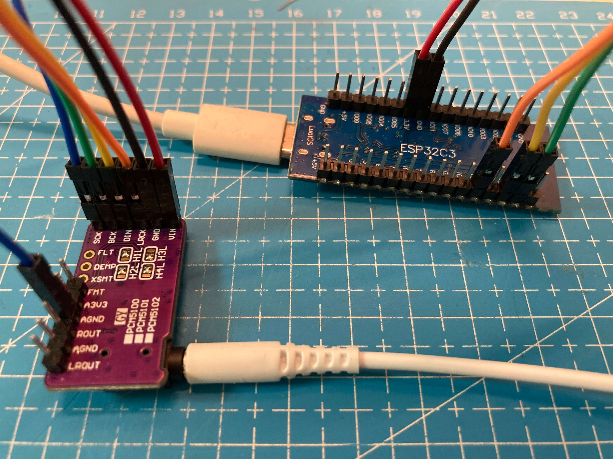

# ESPHome I²S Audio Media Player Components for ESP32 single-core chips
Similar to the Official Component  [I²S Audio Media Player](https://esphome.io/components/media_player/i2s_audio), this is a [External Component](https://esphome.io/components/external_components.html) made for ESPHome, it can be used to create an ESPHome Audio Media Player in Home Assistant.
The difference is that the audio library it uses is from [earlephilhower/ESP8266Audio](https://github.com/earlephilhower/ESP8266Audio), which can run on ESP series single-core chip(like ESP8266, ESP32S2, ESP32C3), so it works on my ESP32C3. 
This component is written separately for the [airm2m_core_esp32c3 ](https://wiki.luatos.com/chips/esp32c3) development board, and you can modify this component yourself to make it work with your own board.

  It is able to :
- Regist an Audio Media Player into HomeAssistant
- MP3 from URL only
- HTTP URL only

Another advantage of  ESP8266Audio over [schreibfaul1/ESP32-audioI2S](https://github.com/schreibfaul1/ESP32-audioI2S) is that, the ESP8266Audio can play wav files from local flash, and I tested it successfully on esp32c3, you can see more samples in [https://github.com/earlephilhower/ESP8266Audio](https://github.com/earlephilhower/ESP8266Audio).

## How to use 
See usage in ESPHome Page [External Component](https://esphome.io/components/external_components.html).
You will see it is easy to use the local path:
1. Clone this repository and copy the `/my_components` folder  to ESPHome ` /config` folder, where you can see your yaml files.
You can modify the local file every time you want.
2. Add this into your yaml:
```
external_components:
- source: my_components

# Default value if not defined : GPIO1 GPIO18 GPIO0
media_player:
- platform: singlecore_i2s_audio
    name: ESPHome I2S Media Player
    dac_type: external
    i2s_dout_pin: GPIO1
    i2s_lrclk_pin: GPIO18
    i2s_bclk_pin: GPIO0
```
3. Connect your DAC module to the development board:
```
dev board     <---->   DAC
i2s_dout_pin  <---->  GPIO1
i2s_lrclk_pin <---->  GPIO18
i2s_bclk_pin  <---->  GPIO0
```

4. Then you can compile and install your firmware.
## Thanks 
This component is modified from:
 - [A post from home-assistant community](https://community.home-assistant.io/t/turn-an-esp8266-wemosd1mini-into-an-audio-notifier-for-home-assistant-play-mp3-tts-rttl/211499/122) 
 - [ An old version of esphome/esphome/components/i2s_audio](https://github.com/esphome/esphome/tree/jesserockz-2023-121/esphome/components/i2s_audio)

Thanks to all them.
